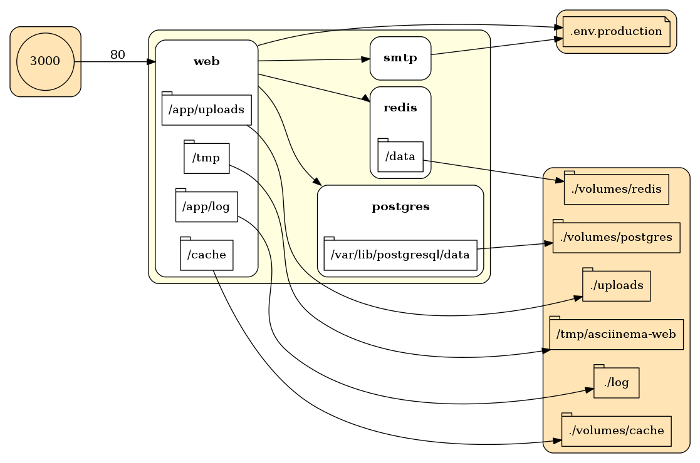

# Docker Workshop

In this workshop you will learn the fundamentals of Docker by deploying and upgrading a non-trivial distributed application, including the development enhancement to the upgrade.  We will roughly be following this outline

- Application Overview and demonstration
- Docker basics
- Docker-izing one component of the application
- Deploying the complete application
- Infrastructure review of the application
- Docker build life-cycle overview
- Enhance and deploy upgraded application
- Open Q&A

## Application Architecture

The application is a live runbook that allows tasks to be demonstrated live using [asciinema](http://asciinema.org).

